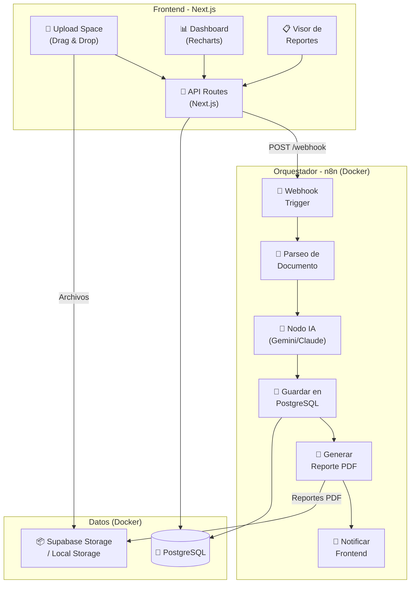
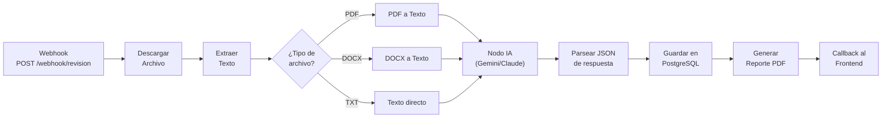

# Sistema de Revisión de Tesis con IA y n8n — Plan de Implementación

## Resumen

Implementar un sistema automatizado que permita cargar tesis (PDF/DOCX/TXT), revisarlas con IA mediante un flujo orquestado por n8n, almacenar resultados en PostgreSQL, y visualizar métricas en un dashboard analítico construido con Next.js.

---

## Decisiones Técnicas ✅

| Decisión | Valor |
|----------|-------|
| Motor de IA | **Gemini** (API) |
| Almacenamiento | **Supabase Storage** |
| Prompt | `PROMPT.docx` (ya existente) |
| Esquema de tesis | `EsquemaPT.docx` — UNT Ingeniería de Sistemas |
| Despliegue | **Local con Docker** |
| Autenticación | No (diferido a futura actualización) |

---

## Arquitectura del Sistema



---

## Estructura del Proyecto

```
revision-tesis-n8n/
├── docker-compose.yml            # n8n + PostgreSQL + (opcionalmente) almacenamiento
├── .env                          # Variables de entorno globales
├── .env.local                    # Variables de entorno de Next.js
│
├── frontend/                     # Aplicación Next.js (App Router)
│   ├── package.json
│   ├── next.config.js
│   ├── prisma/
│   │   └── schema.prisma         # Esquema de BD
│   ├── src/
│   │   ├── app/
│   │   │   ├── layout.tsx        # Layout principal
│   │   │   ├── page.tsx          # Landing / Upload Space
│   │   │   ├── globals.css       # Estilos globales
│   │   │   ├── dashboard/
│   │   │   │   └── page.tsx      # Dashboard analítico
│   │   │   ├── reportes/
│   │   │   │   ├── page.tsx      # Lista de reportes
│   │   │   │   └── [id]/
│   │   │   │       └── page.tsx  # Detalle de reporte
│   │   │   └── api/
│   │   │       ├── upload/
│   │   │       │   └── route.ts  # Endpoint de carga de archivos
│   │   │       ├── tesis/
│   │   │       │   └── route.ts  # CRUD de tesis
│   │   │       ├── webhook-callback/
│   │   │       │   └── route.ts  # Callback desde n8n
│   │   │       └── dashboard/
│   │   │           └── route.ts  # Datos para dashboard
│   │   ├── components/
│   │   │   ├── ui/               # Componentes UI reutilizables
│   │   │   │   ├── Button.tsx
│   │   │   │   ├── Card.tsx
│   │   │   │   ├── Badge.tsx
│   │   │   │   ├── Modal.tsx
│   │   │   │   └── Spinner.tsx
│   │   │   ├── FileUploader.tsx  # Drag & Drop Zone
│   │   │   ├── QueueTable.tsx    # Gestor de colas
│   │   │   ├── ReportViewer.tsx  # Vista dividida del reporte
│   │   │   ├── Navbar.tsx        # Navegación
│   │   │   ├── Sidebar.tsx       # Sidebar del dashboard
│   │   │   └── charts/
│   │   │       ├── ApprovalDonut.tsx    # Tasa de aprobación
│   │   │       ├── ObservationsBar.tsx  # Frecuencia por sección
│   │   │       ├── PerformanceLine.tsx  # Evolución temporal
│   │   │       └── KpiCards.tsx         # Tarjetas de métricas
│   │   └── lib/
│   │       ├── prisma.ts         # Singleton de Prisma
│   │       ├── supabase.ts       # Cliente de Supabase
│   │       └── utils.ts          # Utilidades
│
├── n8n/
│   ├── workflows/
│   │   └── revision-tesis.json   # Workflow exportado de n8n
│   └── prompts/
│       ├── system-prompt.md      # Prompt maestro del revisor IA
│       └── estructura-tesis.md   # Estructura de referencia
│
└── docs/
    └── README.md                 # Documentación del proyecto
```

---

## Fases de Implementación

### Fase 1: Infraestructura Base (Docker + BD)

#### [NEW] docker-compose.yml
Configuración de servicios Docker:
- **PostgreSQL 15**: Base de datos principal para metadatos de tesis, resultados de revisión, y métricas
- **n8n**: Orquestador de flujos con conexión a PostgreSQL
- Red interna Docker para comunicación segura entre servicios

#### [NEW] .env
Variables de entorno para Docker Compose:
- Credenciales de PostgreSQL (usuario, contraseña, nombre de BD)
- Configuración de n8n (encryption key, host, puerto)
- URLs de webhook

---

### Fase 2: Frontend — Inicialización del Proyecto Next.js

#### [NEW] frontend/ (via `npx create-next-app`)
- Next.js 14+ con App Router y TypeScript
- Instalación de dependencias:
  - `prisma` + `@prisma/client` — ORM para PostgreSQL
  - `recharts` — Gráficos del dashboard
  - `@supabase/supabase-js` — Almacenamiento de archivos (si se usa Supabase)
  - `react-dropzone` — Drag & Drop de archivos
  - `lucide-react` — Iconos

---

### Fase 3: Base de Datos (Prisma Schema)

#### [NEW] frontend/prisma/schema.prisma

Modelos principales:

```prisma
model Tesis {
  id              String     @id @default(cuid())
  titulo          String
  autor           String
  archivoUrl      String     // URL del archivo original
  archivoNombre   String
  tipoArchivo     String     // pdf, docx, txt
  tamanioBytes    Int
  estado          EstadoRevision @default(EN_COLA)
  createdAt       DateTime   @default(now())
  updatedAt       DateTime   @updatedAt
  revision        Revision?
}

model Revision {
  id                  String   @id @default(cuid())
  tesisId             String   @unique
  tesis               Tesis    @relation(fields: [tesisId], references: [id])
  estadoGeneral       String   // "Aprobado", "Observado", "Rechazado"
  puntuacionGeneral   Float
  tiempoProcesamiento Int      // en segundos
  reportePdfUrl       String?
  observaciones       Json     // Array de observaciones por sección
  createdAt           DateTime @default(now())
}

enum EstadoRevision {
  EN_COLA
  PROCESANDO
  COMPLETADO
  ERROR
}
```

---

### Fase 4: Frontend — Interfaz de Usuario

#### [NEW] src/app/globals.css
Sistema de diseño con:
- Tema oscuro premium con glassmorphism
- Variables CSS para colores, tipografía, espaciado
- Animaciones y transiciones suaves
- Google Font: Inter

#### [NEW] src/app/layout.tsx
Layout principal con:
- Navbar con navegación entre módulos
- Sidebar colapsable
- Diseño responsive

#### [NEW] src/app/page.tsx — Módulo de Ingesta (Upload Space)
- Zona de Drag & Drop (soporte individual y batch)
- Panel de configuración (selección de estructura de tesis)
- Tabla de estado de documentos (Gestor de Colas):
  - `EN_COLA` → `PROCESANDO` → `COMPLETADO` / `ERROR`
- Polling automático para actualizar estados

#### [NEW] src/app/dashboard/page.tsx — Dashboard Analítico
Gráficos con Recharts:
- **Donut Chart**: Tasa de Aprobación (Aprobadas vs. Observadas vs. Rechazadas)
- **Bar Chart**: Frecuencia de observaciones por sección de la tesis
- **Line Chart**: Evolución del rendimiento a lo largo del tiempo
- **KPI Cards**: Tiempo promedio de procesamiento, total revisadas, tasa de aprobación

#### [NEW] src/app/reportes/page.tsx — Lista de Reportes
- Tabla con filtros y búsqueda
- Estado con badges de colores
- Acceso al detalle de cada reporte

#### [NEW] src/app/reportes/[id]/page.tsx — Visor de Reporte Individual
- **Vista dividida**: 
  - Izquierda: Resumen (estado, puntuación, fecha)
  - Derecha: Detalle de observaciones por capítulo
- Botón de descarga de reporte PDF

---

### Fase 5: API Routes (Backend del Frontend)

#### [NEW] src/app/api/upload/route.ts
- Recibe archivo vía `multipart/form-data`
- Valida tipo y tamaño del archivo
- Sube a Supabase Storage (o almacenamiento local)
- Crea registro en BD con estado `EN_COLA`
- Dispara webhook de n8n con URL del archivo y metadatos

#### [NEW] src/app/api/tesis/route.ts
- `GET`: Lista todas las tesis con su estado
- Filtros por estado, fecha, autor

#### [NEW] src/app/api/webhook-callback/route.ts
- Recibe resultados del procesamiento de n8n
- Actualiza estado de la tesis a `COMPLETADO` o `ERROR`
- Guarda la revisión con observaciones en la BD

#### [NEW] src/app/api/dashboard/route.ts
- Agrega datos para los gráficos del dashboard
- Calcula métricas: tasa de aprobación, promedio de puntuación, frecuencia de observaciones

---

### Fase 6: Flujo de Automatización en n8n

> [!IMPORTANT]
> Esta fase se configura manualmente dentro de la interfaz de n8n (http://localhost:5678), pero proporcionaré el workflow exportado como JSON para importar directamente.

#### Workflow: `revision-tesis`



**Nodos clave:**
1. **Webhook Trigger**: Recibe `POST` con `{archivoUrl, tesisId, titulo, estructura}`
2. **HTTP Request**: Descarga el archivo desde la URL
3. **Extract from File**: Convierte PDF/DOCX a texto plano
4. **AI Agent (Gemini/Claude)**: Ejecuta el prompt de revisión con el texto de la tesis + estructura de referencia, devolviendo JSON estructurado
5. **PostgreSQL**: Inserta resultado de revisión
6. **HTTP Request**: Callback `POST` al frontend con el resultado

#### [NEW] n8n/prompts/system-prompt.md
Prompt maestro que instruye a la IA:
- Rol: Evaluador académico experto
- Reglas estrictas de revisión
- Formato de salida: JSON estructurado
- Mapping directo con la estructura de tesis

---

### Fase 7: Integración y Testing

- Pruebas end-to-end del flujo completo:
  1. Subir archivo desde el frontend
  2. Verificar que n8n recibe el webhook
  3. Verificar que la IA procesa y devuelve JSON
  4. Verificar que el resultado se guarda en PostgreSQL
  5. Verificar que el dashboard muestra los datos correctamente
- Seed de datos de prueba para el dashboard

---

## Verificación

### Pruebas Automatizadas
- `docker compose up -d` — Verificar que PostgreSQL y n8n inician correctamente
- `npx prisma migrate dev` — Verificar esquema de BD
- `npm run dev` — Verificar que el frontend inicia sin errores
- Prueba manual de carga de archivo y verificación del flujo completo

### Verificación Visual (Browser)
- Verificar UI del Upload Space con Drag & Drop
- Verificar dashboard con gráficos renderizados
- Verificar visor de reportes con vista dividida
- Verificar diseño responsive en diferentes tamaños

---

## Orden de Implementación Recomendado

| Paso | Componente | Dependencia | Tiempo Est. |
|------|-----------|-------------|-------------|
| 1 | `docker-compose.yml` + `.env` | Ninguna | 15 min |
| 2 | Crear proyecto Next.js + dependencias | Docker corriendo | 10 min |
| 3 | Prisma Schema + migraciones | PostgreSQL corriendo | 15 min |
| 4 | Sistema de diseño CSS + Layout | Next.js creado | 30 min |
| 5 | Módulo Upload Space + API upload | Layout + Prisma | 45 min |
| 6 | API Routes (tesis, callback, dashboard) | Prisma | 30 min |
| 7 | Dashboard con Recharts | API dashboard | 45 min |
| 8 | Visor de Reportes | API tesis | 30 min |
| 9 | Flujo n8n (configuración manual) | Todo lo anterior | 45 min |
| 10 | Integración + Testing | Todo | 30 min |

> [!NOTE]
> El tiempo total estimado es de **~5 horas** de desarrollo activo, sin contar la configuración de cuentas externas (Supabase, API keys de IA).
